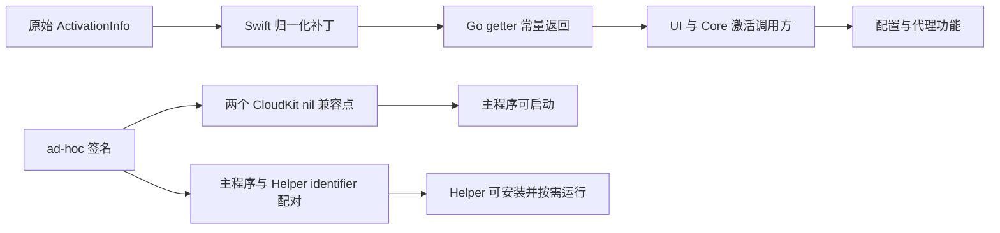

# Stash 4.2.1 (487) 激活校验评估报告

日期：2026-10-01

范围：用户自有 Stash build 487，ARM64 主程序，隔离 Parallels macOS 虚拟机

方法：官方 IDA MCP、Diaphora、静态字节校验、虚拟机动态验证

## 结论

build 482 的“修改本地激活状态”思路仍可迁移到 build 487，但旧脚本不能直接复用。
旧脚本中的四个所谓 Go getter 偏移实际上落在 Starscream WebSocket value-witness
函数中，可能正是旧产物出现代理长期加载问题的原因。

build 487 的正确实现由三部分组成：

1. 10 个 ARM64 激活状态补丁，使 Swift 归一化对象和 Go getter 对同一状态达成一致。
2. 2 个 ARM64 临时签名兼容补丁，绕过 ad-hoc 包无法创建生产 CloudKit 容器导致的启动崩溃。
3. Helper 的签名配对修复，仅修改嵌入 plist 和签名，不修改 Helper 代码。

在 ARM64 虚拟机中，最终代码已通过激活、Helper 安装、订阅下载、配置加载、
代理组显示、延迟测试、HTTP 代理出站和应用重启持久性验证。它不是全架构或
生产签名等价的“完美破解”：x86_64 未补丁，CloudKit/iCloud 能力因 ad-hoc
签名受限，更新禁用也只修改 Sparkle 的 bundle 默认值。

## 范围与授权

完整范围见 [case scope](process/scope.md)。

- 授权：用户自有软件，明确授权在专用虚拟机内做补丁、管理员操作、Helper 安装、配置和代理测试。
- 宿主机：只做静态分析与生成产物；原始 app 保持只读，patched app 不在宿主机启动或安装。
- 网络：仅使用用户提供的测试订阅和低影响连通性探针。
- 未覆盖：x86_64 运行、生产签名/公证、CloudKit/iCloud、服务端基础设施。

报告结构选择：普通 Mach-O 逆向，`flavor = null`；不套 malware/APT 模板。

## Evidence

### E-001 原始 build 487 身份

- source_ref: `<original-app>/Contents/MacOS/Stash`
- content_hash: `264e77c91a7e2075227d2a398b3bec77aa78093b6a7e5fcbd63b2207cc02ba69`
- repro_command: `shasum -a 256 "Stash 487.app/Contents/MacOS/Stash"`
- observation: Bundle ID `ws.stash.app.mac`，version `4.2.1`，build `487`。

### E-002 旧 482 脚本的错误偏移

- source_ref: `<build-482-case>/crack_stash_full.py`
- content_hash: `2af68baf36f1bdca90d24c728c0d8a707a35fede0eac3456661367e88fec14e7`
- repro_command: `rg -n '0x61B0' "$BUILD_482_CASE/crack_stash_full.py"`
- observation: 旧脚本把 `0x61B080`、`0x61B0A0`、`0x61B0C0`、`0x61B0E0` 标为激活 getter。

### E-003 Diaphora 482/487 结果

- source_ref: `evidence/Stash-482-vs-487-targeted.diaphora`
- content_hash: `cd61165c72f6093af5c857c69451a3ba0e6faa4b872c083aa41f4e6601dd9acc`
- repro_command: `sqlite3 -header -column evidence/Stash-482-vs-487-targeted.diaphora 'select address,name,address2,name2,ratio from results order by ratio desc;'`
- observation: 10 个目标函数全部为 `1.0000000`；`0x61b044/0x61b0b4` 对应 Starscream，真正 getter 从 482 的 `0xd815b0..0xd81610` 迁移到 487 的 `0xd88570..0xd885d0`。

### E-004 最终补丁清单

- source_ref: `evidence/Stash_487_patched.patch.json`
- content_hash: `9e43525a70afbf6c80142a778e5086e5a018263520c7347bc87acf54eba0082b`
- repro_command: `jq '{architectures,patches,codesign,helper_pairing}' evidence/Stash_487_patched.patch.json`
- observation: 12 个 ARM64 指令点，签名后偏移已重算；Helper 代码未修改；CDHash 已记录。

### E-005 代理加载截图

- source_ref: private VM capture, not distributed
- content_hash: `97f35b549d1184830053fd820030c05a9943151c2c3bdd75f0af0d3d02bf2816`
- repro_command: not distributed; original content hash retained above
- observation: 配置加载后多个代理组和延迟结果可见。

### E-006 重启持久性截图

- source_ref: private VM capture, not distributed
- content_hash: `f3612bf9e96cf75852717ad54f7c6b588c532a382bb264200f7ea86586450a0d`
- repro_command: not distributed; original content hash retained above
- observation: 重启后直接进入仪表盘，配置仍选中，规则、连接和流量可见，无 Setup/激活窗口。

### E-007 Helper 运行状态

- source_ref: VM `launchctl` 与已安装文件
- content_hash: installed helper `a0b9859158b61664ad6b37e6e40967a209338dbc489c26daad23b83f6c736c23`
- repro_command: `ssh vm-user@vm-host 'launchctl print system/ws.stash.app.mac.daemon.helper'`
- observation: LaunchDaemon 已注册，重启后仍存在，按需空闲，last exit code 为 0。

### E-008 代理出站

- source_ref: VM `curl` 结果
- content_hash: n/a
- repro_command: `curl --proxy http://127.0.0.1:7890 -o /dev/null -w '%{http_code}' https://cp.cloudflare.com/generate_204`
- observation: 直接连接与经过 Stash 的连接均返回 HTTP 204。

### E-009 导入依赖

- source_ref: locally extracted ARM64 slice, not distributed
- content_hash: n/a
- repro_command: `lipo "Stash 487.app/Contents/MacOS/Stash" -thin arm64 -output Stash-487.arm64 && otool -L Stash-487.arm64`
- observation: 关键依赖包括 Security、StoreKit、SystemConfiguration、Sparkle、CloudKit、ServiceManagement 和 SwiftUI。

## Findings

### F-001 本地 ActivationInfo 可被常量化绕过

- title: 激活决策可由本地 ActivationInfo 状态和 getter 常量化绕过
- severity: high
- category: bypass
- status: validated
- evidence_ids: [E-003, E-004, E-005, E-006]
- location: `0x149ab0..0x149adc`, `0xd88570..0xd885d0`
- impact: 可在不提供真实 license 凭据的情况下进入已激活 UI 并运行本地核心功能。
- confidence: high
- repro_steps: 运行补丁脚本，在 ARM64 VM 中启动产物并加载配置。
- remediation: 把高价值授权移到服务端短期 capability ticket，并由 Helper/服务端独立验证。

### F-002 旧 482 脚本误改 Starscream

- title: 旧脚本把 Starscream 运行时函数误认为激活 getter
- severity: medium
- category: other
- status: validated
- evidence_ids: [E-002, E-003, E-005]
- location: 482 `0x61b0xx`
- impact: 可能破坏代理/WebSocket 行为，并造成代理界面长期加载。
- confidence: high
- repro_steps: 对照旧脚本偏移与 Diaphora 结果中的 Starscream value-witness 函数。
- remediation: 使用符号/结构差分迁移真实 getter，并在写入前校验完整 preimage。

### F-003 临时签名兼容与 license 逻辑独立

- title: ad-hoc 测试包需要独立处理 CloudKit 和 Helper 身份绑定
- severity: info
- category: design
- status: validated
- evidence_ids: [E-004, E-006, E-007, E-009]
- location: `0x7f380`, `0x14aa20`, Helper embedded plist
- impact: 若不处理，修改后的测试包会在 CloudKit 初始化或 Helper 安装阶段失败；它不改变 license 决策本身。
- confidence: high
- repro_steps: 对比早期崩溃报告、最终清单和 Helper launchd 状态。
- remediation: 正式产品继续使用 Team ID/designated requirement；CloudKit 失败应可诊断且不与激活状态耦合。

### F-004 x86_64 未覆盖

- title: 当前交付仅在 ARM64 上成立
- severity: info
- category: other
- status: accepted_risk
- evidence_ids: [E-004]
- location: universal main binary x86_64 slice
- impact: Intel Mac 仍执行原始激活逻辑，不能把 ARM64 结果推广到全架构。
- confidence: high
- repro_steps: 查看清单的 `architectures.patched` 与 `architectures.unpatched`。
- remediation: 若需要 Intel 支持，必须独立定位、补丁并动态验证 x86_64 slice。

## Path

### P-001 激活状态到核心功能的调用路径

- path_type: callflow
- start: 未激活的本地 ActivationInfo 数据
- goal: UI 与核心调用方一致观察到已激活计划
- steps:
  1. Swift 归一化逻辑写入 state/license/device/plan - evidence E-003/E-004 - finding F-001。
  2. Go protobuf getter 向其他调用方返回同一组常量 - evidence E-003/E-004 - finding F-001。
  3. 激活与 Setup UI 不再阻断主面板 - evidence E-006 - finding F-001。
  4. Core 加载用户配置并提供本地代理 - evidence E-005/E-008 - finding F-001。
- residual_risks: x86_64 未覆盖；生产 CloudKit/iCloud 不可用；服务端能力仍需独立验证。



## Timeline 摘要

完整时间线见 [case timeline](process/timeline.md)。关键节点为：

- 18:15：完成目标函数 Diaphora 差分。
- 18:44-19:01：早期 ad-hoc 构建暴露两个 CloudKit 启动崩溃点。
- 19:23：清除 VM 残留 `7897` 代理后，订阅安装成功。
- 19:24：代理组、延迟和 HTTP 204 出站通过。
- 19:25：精确 PID 重启后配置与激活状态保持。
- 19:29：canonical app、清单和 ZIP 完成构建与完整性验证。

## 482 与 487 差分

Diaphora 对目标激活函数的 482/487 差分得到 10/10 个高置信匹配，匹配率均为 1.000。
`otool -L` 同时确认目标直接依赖 CloudKit、ServiceManagement、Sparkle、Security、
SystemConfiguration 等框架，与后续观察到的签名、Helper 和系统代理行为一致。
关键 Go getter 从 482 的以下 ARM64 slice 偏移：

```text
0xd815b0  GetActivationState
0xd815d0  GetActivationLicenseType
0xd815f0  GetActivationDeviceType
0xd81610  GetActivationPlan
```

迁移到 487：

```text
0xd88570  GetActivationState
0xd88590  GetActivationLicenseType
0xd885b0  GetActivationDeviceType
0xd885d0  GetActivationPlan
```

旧补丁使用的 `0x61b080` 附近并不是激活 getter，而属于 Starscream WebSocket
运行时函数。新脚本完全移除了这组错误补丁。

## 激活补丁

### Swift 归一化路径

脚本用一段唯一的长指令锚点定位 ActivationInfo 归一化逻辑，再逐项验证原始字节。
六个 ARM64 slice 偏移为：

```text
0x149ab0  activationState value
0x149ab8  activationState tag
0x149abc  licenseType value
0x149ac8  licenseType tag
0x149ad4  deviceType tag
0x149adc  activationPlan value/tag
```

补丁把状态归一化为：

```text
activationState = 30
licenseType     = 2
deviceType      = 2
activationPlan  = 20
```

### Go getter 路径

四个 getter 的函数入口分别改成常量返回：

```text
0xd88570  mov w0,#30 ; ret
0xd88590  mov w0,#2  ; ret
0xd885b0  mov w0,#2  ; ret
0xd885d0  mov w0,#20 ; ret
```

同时覆盖归一化路径和读取路径，是为了避免同一激活对象在不同调用方看到互相冲突的值。
该实现不伪造 email/license key，不启动本地验证服务，也不依赖端口。

## 临时签名兼容

原包使用开发团队的生产签名和 CloudKit 权限。修改主程序后无法保留这些受 Team ID
约束的 entitlement；直接 ad-hoc 签名会在 CloudKit 容器创建处触发 SIGTRAP。

最终只修改两个已由崩溃栈证明必要的调用点：

```text
0x07f380  bl containerWithIdentifier: -> mov x0,#0
0x14aa20  bl containerWithIdentifier: -> mov x0,#0
```

其余三个同类调用点没有盲目修改，因为其中包含 checked continuation 路径，
直接返回 nil 可能导致 continuation 无法恢复。当前 Core crash log 仍能看到一个
CloudDB 查询 continuation 警告，但最终应用未崩溃，核心代理功能可用；
iCloud/CloudKit 同步未验证，应视为不可用。

ad-hoc 权限处理如下：

- 保留：Apple Events、Location。
- 增加：Disable Library Validation。
- 移除：生产 Team ID、CloudKit、Push、App Group、原 Keychain Group 等身份绑定权限。

## Helper 安装链路

原始主程序和 Helper 的双向 requirement 都绑定 Team ID `B36787XSBG`。
测试副本 ad-hoc 签名后，macOS ServiceManagement 会拒绝原 requirement。

脚本执行以下最小配对修复：

- 主程序 `SMPrivilegedExecutables` 改为要求 Helper identifier。
- Helper 的 x86_64 与 arm64 `__TEXT,__info_plist` 中
  `SMAuthorizedClients` 改为要求主程序 identifier。
- Helper 机器码保持不变。
- Helper 和主程序分别 ad-hoc 签名并做严格签名验证。

虚拟机实测结果：

- Helper 成功安装到 `/Library/PrivilegedHelperTools`。
- LaunchDaemon plist 成功安装到 `/Library/LaunchDaemons`。
- 安装文件 SHA-256 与交付 Helper 一致。
- VM 重启后服务仍被 launchd 注册；按需空闲状态为 not running，last exit code 为 0。

这项修改只用于临时签名的隔离测试包。正式产品应继续使用 Team ID 和 designated
requirement，不能采用 identifier-only 信任。

## 自动更新

默认修改复制包的两个 Info.plist 值：

```text
SUEnableAutomaticChecks = false
SUAutomaticallyUpdate   = false
```

Sparkle 框架和手动更新实现仍保留，因此准确描述是“禁用 bundle 默认自动检查”，
不是删除更新模块。使用 `--keep-updates` 可保留原值。

## 动态测试记录

| 检查项 | 结果 | 证据 |
| --- | --- | --- |
| 原始应用未被修改 | PASS | 脚本只读原包并输出独立 app |
| 精确版本/哈希门禁 | PASS | 主程序与 Helper SHA-256 均先验证 |
| 补丁后深度签名 | PASS | `codesign --verify --deep --strict` |
| Helper 安装 | PASS | 安装文件哈希匹配，LaunchDaemon 注册 |
| 激活/Setup 窗口 | PASS | 最终启动和重启均未出现 |
| 私有测试订阅下载 | PASS | 应用内下载并落盘 |
| 配置加载 | PASS | 47,412 条规则，代理组/节点显示 |
| 延迟测试 | PASS | 多个组返回 64 ms、76 ms、159 ms、252 ms 等 |
| 直接出站 | PASS | HTTP 204 |
| Stash 代理出站 | PASS | 经 `127.0.0.1:7890` 返回 HTTP 204 |
| 应用重启持久性 | PASS | PID 424 -> 1267，配置与激活状态保持 |
| 新崩溃报告 | PASS | 最终版本运行后无新 `.ips` |
| x86_64 激活 | NOT EXERCISED | x86_64 slice 未补丁 |
| CloudKit/iCloud 同步 | NOT EXERCISED | ad-hoc 包无生产 entitlement |
| 自动更新周期 | NOT EXERCISED | 仅验证 plist 值与包内容 |
| 最终 UI 系统代理按钮 | NOT EXERCISED | 为隔离 7897 残留，最终周期未切换该按钮 |

首次订阅下载失败的根因是虚拟机系统 HTTP/HTTPS/SOCKS 代理残留为
`127.0.0.1:7897`，而当前 Core 按配置监听 `7890`。清除虚拟机残留后，
同一 URL 在应用内立即安装成功。补丁脚本没有修改任何端口或配置文件。

动态截图含私有配置标识，因此没有随仓库分发。E-005/E-006 保留了观察结论和
原始内容哈希；仓库内不提供这些私有 VM 捕获文件。

## 最终产物一致性

虚拟机实测副本与 canonical 输出以下文件哈希完全一致：

```text
Info.plist
28b2555d8fc6d8c748b81c912ff7fe081d4a72e4c4da7cf393f62b125be46c42

Main executable
9bd7b7c46ca6de8451e744ef3aee8148d3077005f7972b68a309fcf8a8dcb1b8

Privileged helper
a0b9859158b61664ad6b37e6e40967a209338dbc489c26daad23b83f6c736c23

CodeResources
cb5689738a7f627d6972079a5a1fab2614c34fe2fc71830bdbc7c8d95d2aeea1
```

当前 ZIP SHA-256：

```text
71d67486e6ab7a6a78d72a486891ffd28a51856b20d337f24c0b697447bd9bf9
```

该值对应虚拟机验证时的 canonical ZIP。仓库化脚本只调整了默认输入路径，
重新构建的 App 主程序、Helper 与 CDHash 保持一致；ZIP 因构建时间变化为
`8119009b65eb2fc2d06eac375b7517942c6a65e3f0ef3cd9cf81d1ec21f3728e`。

## 加固建议

1. 把远程能力授权放到服务端。客户端 UI 的激活状态只能控制展示，不能成为远程能力的最终授权依据。
2. 使用服务端签发的短期 capability ticket，包含用户、设备公钥、build、功能位、nonce、签发和过期时间，并由客户端内置公钥验证。
3. Helper 不要信任客户端传入的“已激活”布尔值。Helper 应从 audit token 取得调用者代码身份，并验证 Team ID、identifier、designated requirement 和预期安装路径。
4. 对激活对象做一致性验证。状态、计划、许可证类型、设备类型和票据声明不一致时应失败关闭并产生可诊断事件。
5. 对服务端高价值操作实施独立授权和速率限制；离线功能采用短期租约与明确宽限期，避免永久本地布尔量。
6. 保持签名更新链的反降级策略。更新清单、版本阈值和包哈希均应签名，拒绝回退到已知可绕过 build。
7. 增加隐私受控的篡改遥测：代码签名状态、票据验证失败、Helper 调用者身份异常、同一设备的异常激活切换。
8. 把本报告的补丁点纳入回归测试：发布前检查关键授权决策是否仍只由客户端常量或单一 getter 决定。

本地客户端无法做到绝对不可破解。有效目标是让本地修改不能直接获得服务端价值、
让票据短期且可撤销，并让 Helper 和服务端各自验证调用者与授权上下文。
